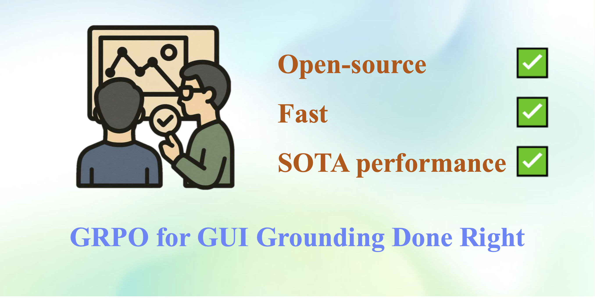

<div align="center">
  <h1>GRPO for GUI Grounding Done Right</h1> 
  
    
<div style="width: 35%; text-align: center; margin:auto;">
      
</div>

    
<div>
   <a href="https://huggingface.co/datasets/HelloKKMe/grounding_dataset/tree/main"><strong>Dataset</strong></a>  | <a href="https://huggingface.co/blog/HelloKKMe/grounding-r1"><strong>Blog</strong></a> |  <a href="https://huggingface.co/HelloKKMe/grounding-r1-7B"><strong>7B Model</strong></a>  |  <a href="https://huggingface.co/HelloKKMe/grounding-r1-32B"><strong>32B Model</strong></a> |  <a href="https://huggingface.co/HelloKKMe/grounding-r1-72B"><strong>72B Model</strong></a>
   </div>   
</div>
    
Reinforcement learning (RL) (e.g., GRPO) helps with grounding because of its inherent objective alignment—rewarding any successful clicks—rather than encouraging long textual Chain-of-Thought (CoT) reasoning (also referred to as “thinking”). In this blog, we will share a complete recipe towards training state-of-the-art GUI grounding models using GRPO.


## 🛠️ Setup

- Install the environment by following the instructions [here](https://github.com/om-ai-lab/VLM-R1?tab=readme-ov-file#%EF%B8%8F-setup).
- Download the training dataset from the [link](https://huggingface.co/datasets/HelloKKMe/grounding_dataset/tree/main).
- If using a custom dataset, please store the data as a list of JSON objects, where each entry follows the structure below:

<pre>
{
    "image": "images/4.png",
    "bbox": [38, 166, 961, 218],
    "conversations": [
        {
            "from": "human",
            "value": "<image>Click on the search bar"
        },
        {
            "from": "gpt",
            "value": "any thing here"
        }
    ]
}
</pre>

**Note:** The bounding box (`bbox`) should use the format `[x0, y0, x1, y1]`, with all coordinates normalized to the range `[0, 1000]`.

## 🧹 Data Cleaning

We provide a cleaned version of the dataset on [Hugging Face](https://huggingface.co/datasets/HelloKKMe/grounding_dataset/tree/main).

If you're using a custom dataset, please refer to the [preprocessing folder](preprocessing/README.md) for instructions on how to clean and format your data.

## [Custom Use] Train Your Model
An example script on slurm
```shell
module load *** ... loading enviroment ***
export *** ... setting your own enviroment vairable ***

export RDZV_HOST=$(hostname)
export RDZV_HOST=$(scontrol show hostnames "$SLURM_JOB_NODELIST" | head -n 1)
export RDZV_PORT=29505

RUN_NAME=test
srun torchrun \
    --nnodes $SLURM_JOB_NUM_NODES \
    --nproc_per_node 8 \
    --max-restarts 3 \
    --rdzv_id $SLURM_JOB_ID \
    --rdzv_backend c10d \
    --rdzv_endpoint "$RDZV_HOST:$RDZV_PORT"  src/grpo_grounding.py \
    --deepspeed local_scripts/zero3.json \
    --output_dir grounding/$RUN_NAME \
    --model_name_or_path "Qwen/Qwen2.5-VL-3B-Instruct"  \
    --dataset_name preprocessing/inp.json \
    --image_root "./preprocessing" \
    --max_prompt_length 1024 \
    --max_completion_length 128 \
    --num_generations 8 \
    --per_device_train_batch_size 1 \
    --freeze_vision_modules true \
    --reward_funcs accuracy \
    --beta 0 \
    --dataloader_num_workers 2 \
    --max_pixels $((4096 * 2160)) \
    --gradient_accumulation_steps 32 \
    --logging_steps 1 \
    --bf16 \
    --torch_dtype bfloat16 \
    --data_seed 42 \
    --report_to tensorboard \
    --gradient_checkpointing true \
    --attn_implementation flash_attention_2 \
    --num_train_epochs 2 \
    --run_name output/$RUN_NAME \
    --save_steps 10 \
    --save_total_limit 4 \
    --save_only_model false
```
✅ Make sure to modify paths, model names, and any relevant hyperparameters based on your specific setup.

## 🧠 Inference

Below is a code snippet demonstrating how to run inference using a trained model.

```python
from PIL import Image
from qwen_vl_utils import process_vision_info, smart_resize
from transformers import Qwen2_5_VLForConditionalGeneration, AutoProcessor
import torch
import re

SYSTEM_PROMPT = '''
You are an expert UI element locator. Given a GUI image and a user's element description, provide the coordinates of the specified element as a single (x,y) point. The image resolution is height {height} and width {width}. For elements with area, return the center point.

Output the coordinate pair exactly:
(x,y)
'''
SYSTEM_PROMPT=SYSTEM_PROMPT.strip()

# Function to extract coordinates from model output
def extract_coordinates(raw_string):
    try:
        matches = re.findall(r"\((-?\d*\.?\d+),\s*(-?\d*\.?\d+)\)", raw_string)
        return [tuple(map(int, match)) for match in matches][0]
    except:
        return 0,0

# Load model and processor
model_path = "HelloKKMe/grounding-r1-32B"
max_new_tokens = 32

model = Qwen2_5_VLForConditionalGeneration.from_pretrained(
    model_path,
    torch_dtype=torch.bfloat16,
    attn_implementation="flash_attention_2",
    device_map="auto"
)
processor = AutoProcessor.from_pretrained(
    model_path,
    min_pixels=3136,
    max_pixels= 4096 * 2160
)

# Load and resize image
image = Image.open("file path")
instruction = "description"  # Instruction for grounding
width, height = image.width, image.height

resized_height, resized_width = smart_resize(
    image.height,
    image.width,
    factor=processor.image_processor.patch_size * processor.image_processor.merge_size,
    min_pixels=processor.image_processor.min_pixels,
    max_pixels=processor.image_processor.max_pixels,
)
resized_image = image.resize((resized_width, resized_height))
scale_x, scale_y = width / resized_width, height / resized_height

# Prepare system and user messages
system_message = {
   "role": "system",
   "content": SYSTEM_PROMPT.format(height=resized_height,width=resized_width)
}

user_message = {
    "role": "user",
    "content": [
        {"type": "image", "image": resized_image},
        {"type": "text", "text": instruction}
    ]
}

# Tokenize and prepare inputs
image_inputs, video_inputs = process_vision_info([system_message, user_message])
text = processor.apply_chat_template([system_message, user_message], tokenize=False, add_generation_prompt=True)
inputs = processor(text=[text], images=image_inputs, videos=video_inputs, padding=True, return_tensors="pt")
inputs = inputs.to(model.device)

# Generate prediction
output_ids = model.generate(**inputs, max_new_tokens=max_new_tokens, do_sample=False, temperature=1.0, use_cache=True)
generated_ids = [output_ids[len(input_ids):] for input_ids, output_ids in zip(inputs.input_ids, output_ids)]
output_text = processor.batch_decode(generated_ids, skip_special_tokens=True, clean_up_tokenization_spaces=True)[0]

# Extract and rescale coordinates
pred_x, pred_y  = extract_coordinates(output_text) 
pred_x*=scale_x
pred_y*=scale_y 
print(pred_x,pred_y)
```

## Contact

Please contact `yan.yang@anu.edu.au` for any queries.

## Acknowledgement

This repository is built using the [VLM-R1](https://github.com/om-ai-lab/VLM-R1) repository.

## Citation
If you use this repository or find it helpful in your research, please cite it as follows:
```bibtex
@misc{yang2025groundingr1,
author = {Yan Yang and Dongxu Li and Yuhao Yang and Ziyang Luo and Yutong Dai and Zeyuan Chen and Ran Xu and Liyuan Pan and Caiming Xiong and Junnan Li},
title = {GRPO for GUI Grounding Done Right},
year = {2025},
howpublished = {https://github.com/Yan98/Grounding-R1/},
}
```

